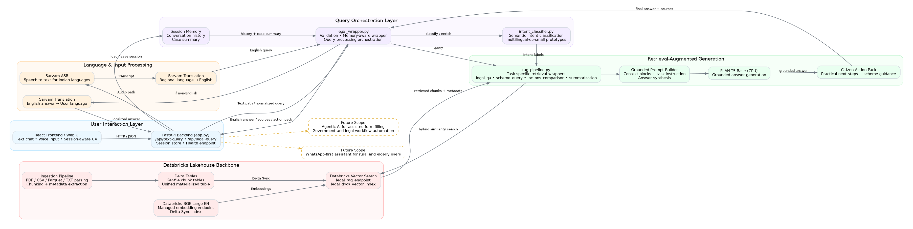

# Samadhan AI

Samadhan AI is a multilingual legal-access assistant built for the Databricks Bharat Bricks hackathon. It helps citizens ask legal and public-support questions through text or voice, retrieves grounded context from Indian legal documents using Databricks Vector Search, and returns practical answers with source-backed guidance and citizen action packs.

## What it does

- Accepts **voice or text input** from users.
- Uses **Sarvam AI** for speech-to-text and translation for Indian languages.
- Uses a **Databricks-backed RAG pipeline** over legal documents.
- Supports **semantic intent classification** for legal Q&A, scheme discovery, IPC/BNS comparison, and legal summarization.
- Returns a **grounded answer**, **source citations**, and a **citizen action pack**.
- Maintains **session memory** so follow-up questions stay context-aware.

## Architecture Diagram



### Architecture Notes

The current codebase is centered around four main modules:

- `sarvam_translation.py` for audio transcription and translation
- `intent_classifier.py` for semantic intent classification
- `rag_pipeline.py` for retrieval and answer generation
- `legal_wrapper.py` for orchestration between query understanding and RAG

The Databricks side uses per-file chunk tables, a unified Delta table, and a single Delta Sync vector index (`workspace.default.legal_docs_vector_index`) served through the `legal_rag_endpoint`.

## Tech Stack

### Databricks Technologies

- Databricks Delta Lake
- Databricks Vector Search
- Delta Sync Index
- Foundation Model endpoint: `databricks-bge-large-en`
- Unity Catalog tables
- Databricks notebooks for ingestion and retrieval workflows

### Open-source Models and Libraries

- `SentenceTransformers` with `intfloat/multilingual-e5-small`
- `transformers` with `google/flan-t5-base`
- `FastAPI`
- `pypdf`
- `pandas`
- `scikit-learn`
- `requests`

### External Services

- Sarvam AI for ASR and translation

## Current Flow

1. User sends a text query or speaks through the frontend.
2. Audio is transcribed using Sarvam ASR.
3. Non-English input is translated to English.
4. The wrapper layer prepares the request and routes it to the RAG pipeline.
5. Semantic intent classification identifies the most likely task type.
6. The RAG pipeline queries Databricks Vector Search using hybrid search.
7. Retrieved chunks are turned into a grounded prompt.
8. A CPU-friendly generator produces the response.
9. The app formats sources and a citizen action pack.
10. The answer is translated back if needed and returned to the user.

## Repository Structure

```text
.
├── app.py
├── modules/
│   ├── sarvam_translation.py
│   ├── intent_classifier.py
│   ├── rag_pipeline.py
│   └── legal_wrapper.py
├── notebooks/
│   └── Legal Rag Ingestation Pipeline.py
├── frontend/
└── README.md
```

## How to Run

### 1. Clone the repository

```bash
git clone <your-public-github-repo-url>
cd <repo-name>
```

### 2. Install Python dependencies

```bash
pip install fastapi uvicorn requests pydantic transformers sentence-transformers scikit-learn pypdf pandas databricks-vectorsearch
```

### 3. Set environment variables

```bash
export SARVAM_API_KEY="your_sarvam_api_key"
```

If using Databricks-hosted execution, configure the environment through your Databricks App or notebook environment instead.

### 4. Prepare the Databricks index

Run the ingestion notebook to:

- parse legal PDFs, CSVs, Parquet files, and text files
- create chunk tables in Delta
- materialize a unified Delta table
- create the Vector Search index

Expected Databricks assets:

- Endpoint: `legal_rag_endpoint`
- Index: `workspace.default.legal_docs_vector_index`

### 5. Start the backend

```bash
uvicorn app:app --host 0.0.0.0 --port 8000 --reload
```

### 6. Open the frontend

Serve your frontend and connect it to the backend routes:

- `POST /api/text-query`
- `POST /api/legal-query`
- `GET /api/health`

## Demo Steps

### Text Demo

1. Open the app.
2. Type a legal question in English or an Indian language.

Suggested prompts:

- `I was cheated in an online payment. What law applies?`
- `What should I do next?`
- `Are there any government schemes that can help me?`
- `Explain the difference between IPC and BNS for cheating.`

### Voice Demo

1. Click the microphone input.
2. Speak in Hindi or another supported Indian language.
3. Show English retrieval plus answer translation back to the original language.

Suggested Hindi prompt:

- `मुझे ऑनलाइन पेमेंट में धोखा दिया गया है, मैं क्या करूँ?`

## Why this stands out

Samadhan AI is not just a chatbot over legal PDFs. It combines:

- multilingual access
- Databricks-native retrieval
- grounded legal answers
- practical citizen action steps

This makes it especially relevant for rural users, first-time legal seekers, and citizens who need simple, trustworthy legal guidance.

## Future Scope

In future versions, the system can be extended with **agentic AI** to help citizens automatically fill government scheme forms and legal service forms by interacting with official workflows step by step.

It can also be evolved into a **WhatsApp-based assistant** so rural users and elderly citizens can access legal help, scheme discovery, and guided public-service support through a familiar interface.

## Submission Write-up (<= 500 characters)

Samadhan AI is a multilingual legal-access assistant built on Databricks. It combines Sarvam AI for speech and translation, semantic intent classification, Databricks Vector Search, and grounded RAG over Indian legal documents to deliver clear legal guidance, source-backed answers, and citizen action packs. The system is designed to make legal help more accessible for everyday users across India.
